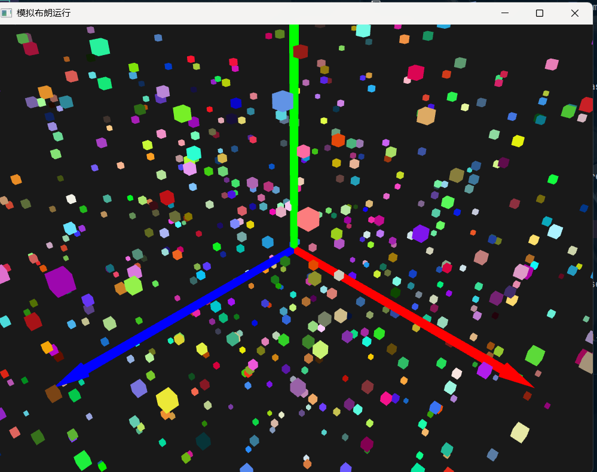

# use-threed
# 运行base
```shell
cargo run --example base --release
```
## 结果如下

# 模拟布朗运动
```shell
cargo run --example particle --release
```
## 结果如下

# 运行马尔可夫链
```shell
cargo run --example mdp --release
```
## 结果如下
